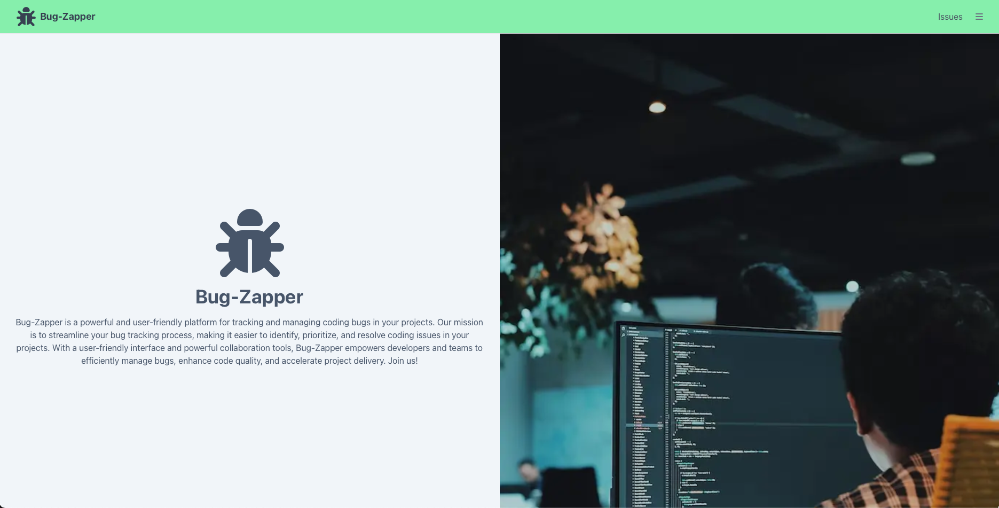
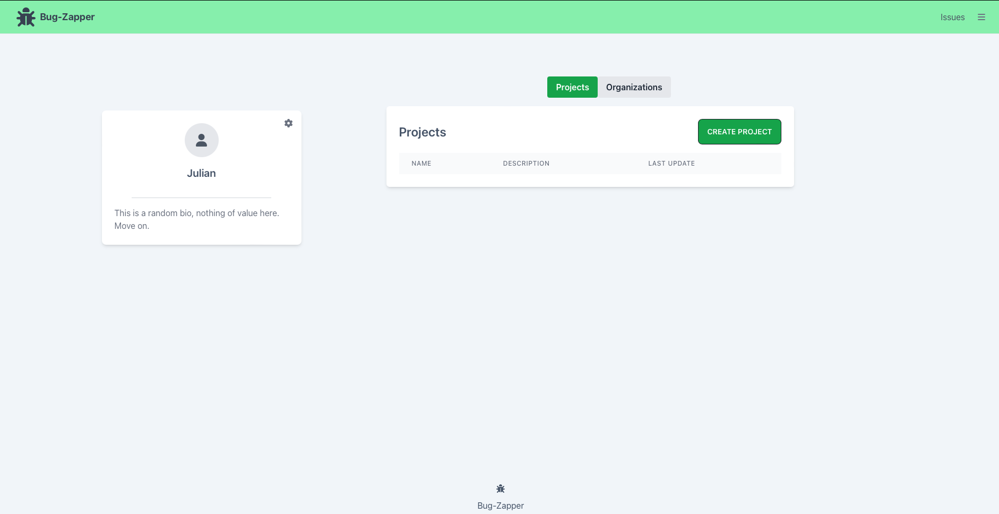
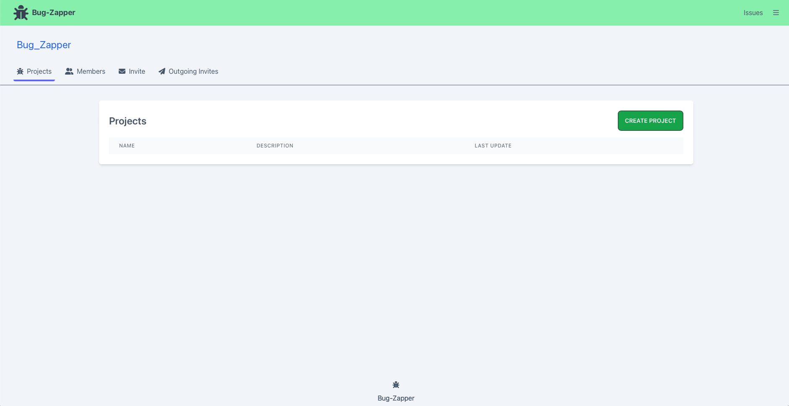
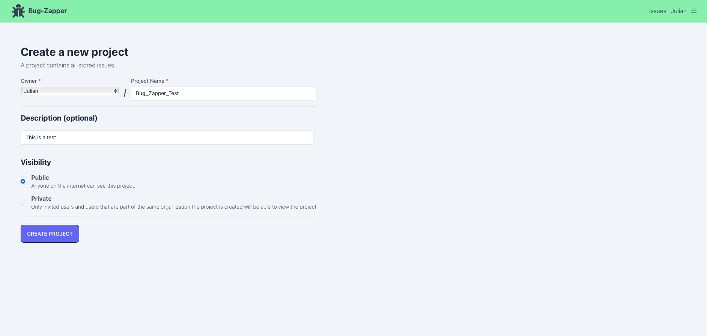

# Bug-Zapper

Bug-Zapper is  web app that helps programmers manage and resolve software bugs more efficiently. The idea came from a user story where a team of developers struggled with keeping track of bugs and coordinating their efforts. Bug-Zapper aims to streamline this process by providing a platform for easy bug reporting, tracking, and collaboration.

The front-end is designed to be user-friendly and easy to use. Users can easily search and manage issues in a fast, efficient, and organized manner.

## Tech Stack

Bug-Zapper is built with the following technologies:

* NextJS
* Prisma
* Tailwind CSS
* JavaScript
* React

## Getting Started

To get started with Bug-Zapper, follow these steps:

* Clone the repository to your local machine.
* Install dependencies by running npm install.
* Run npm run dev to start the development server.
Open http://localhost:3000 in your browser.

## Screen Shots
Home Page

User Page

Organization Page

Create Project

## Authors

- [Julian Paredes](https://github.com/jpared3s)
- [Andrew Caruso](https://github.com/Yzma)